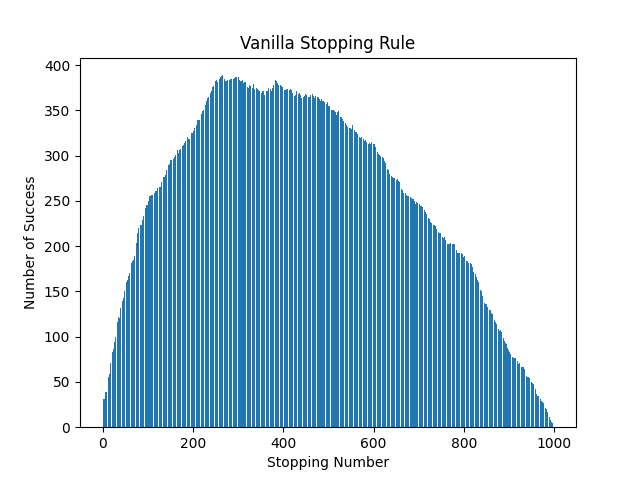
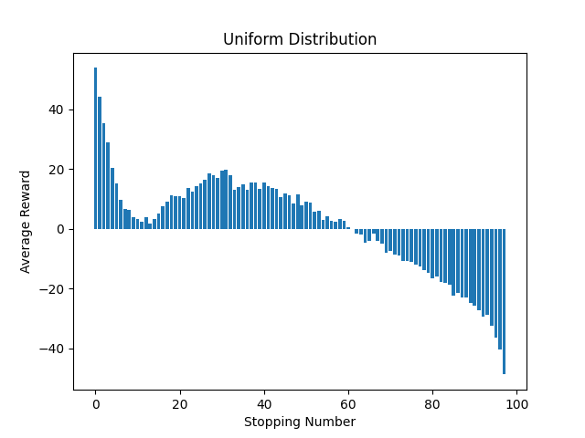
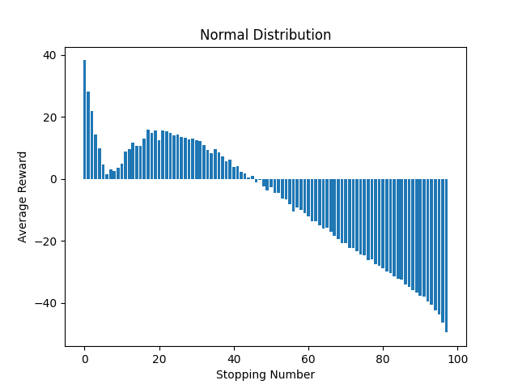

# Optimal Stopping

## Results problem 1

* Here is the distribution of success rates for the 1000 random data sets with 1000 elements:

* ### Fall off algoritm
  * A falloff algoritm detirments whenther or not the max look should be lowered.
  * max_look can be decremented with the percentage of (current index - stopping number)/ (end of list - stopping number) = percent_diff
  * the follwing logic is used to decide whether to decrement and by how much

     ```python3
        if np.random.rand() < percent_diff:
            max_look -= 1*(1+percent_diff)
    ```



* The maximum indicies normalized to percent of the data set size: 39.3%.
* When this percentage is applide to the two given scenarios the following results are obtained:

| Scenario # | Derived Optimal | 37 percent rule|
| --------   | -----------     | ----------- |
|   #1       |  96             | 56          |
|   #2       |  86             | 72          |

## Results Problem 2

### Results Uniform



### Results Normal


